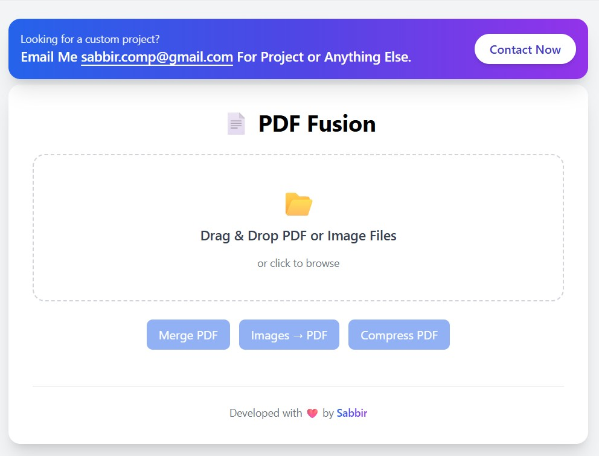

# 🚀 PDF Fusion

  <b>Modern Full-Stack PDF Processing Platform</b> 
  Built with .NET Core Web API & React (TypeScript + Tailwind)

  
  
  
  
  

---

## 📌 Overview

**PDF Fusion** is a modern, full-stack PDF processing platform that allows users to:

- Merge multiple PDF files  
- Compress PDF documents  
- Convert images (JPG/PNG) to PDF  
- Upload files with drag-and-drop  
- View selected file previews  
- Process files asynchronously  

This project demonstrates clean architecture principles, modern UI design, and scalable backend development.

---

## 🏗️ Architecture

### Backend Highlights
- ASP.NET Core Web API
- Clean Architecture
- Strategy Pattern
- Facade Pattern
- Asynchronous file processing
- Ghostscript integration for compression

### Frontend Highlights
- React + TypeScript
- Tailwind CSS (Modern UI)
- Drag & Drop Upload
- Progress Bar
- Clean Component Structure
- Service Layer abstraction

---

## ✨ Features

### 🔹 Merge PDF
Combine multiple PDF files into one document.

### 🔹 Compress PDF
Reduce PDF file size using optimized processing.

### 🔹 Images to PDF
Convert JPG / PNG images into a single PDF file.

### 🔹 Modern UI
- Drag & Drop Upload
- File preview list
- Clean responsive layout
- Premium freelancer-style portfolio UI

---

## 📸 Screenshots

> Add screenshots inside `/docs/screenshots`

⚙️ Installation & Setup

1️⃣ Clone Repository
git clone https://github.com/sabbiraliseikh892/pdf-fusion.git
cd pdf-fusion
🖥 Backend Setup (.NET API)

API will run on:
https://localhost:7100

🌐 Frontend Setup (React)
cd frontend
npm install
npm run dev

🔐 Environment Variables
Create .env in frontend root:
VITE_API_BASE_URL=https://localhost:7100/api

📦 Tech Stack
| Layer       | Technology     |
| ----------- | -------------- |
| Backend     | ASP.NET Core 8 |
| Frontend    | React 18       |
| Language    | TypeScript     |
| Styling     | Tailwind CSS   |
| PDF Library | PDFSharp       |
| Compression | Ghostscript    |

🎯 Purpose of This Project
This project was built to demonstrate:
Full-stack development capability
Clean architecture implementation
Modern UI/UX practices
Real-world file processing
Scalable application structure

👨‍💻 Developed By
Sabbir
Full-Stack .NET Developer

⭐ Support
If you found this project useful, consider giving it a ⭐ on GitHub.
